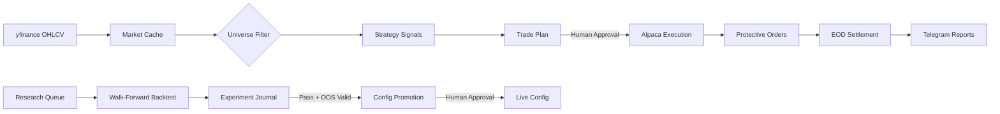

<div align="center">

# ⚡ Atlas

**Algorithmic swing-trading lab that researches, backtests, and live-trades systematic strategies on US equities.**

[](https://python.org)
[](#-broker)
[](#-strategies)
[](#-automation)

---

**S&P 500** via Alpaca &nbsp;•&nbsp; $0 commission &nbsp;•&nbsp; Fully automated daily operations

</div>

---

## 🏗️ Architecture

```
┌─────────────────────────────────────────────────────────────────────┐
│                        ATLAS TRADING SYSTEM                        │
├─────────────────────────────────────────────────────────────────────┤
│                                                                     │
│   ┌──────────┐    ┌──────────┐    ┌──────────┐    ┌──────────┐     │
│   │  Ingest   │───▶│ Universe │───▶│ Strategy │───▶│  Planner │     │
│   │ (yfinance)│    │  Filter  │    │  Engine  │    │          │     │
│   └──────────┘    └──────────┘    └──────────┘    └────┬─────┘     │
│                                                         │           │
│                                                         ▼           │
│   ┌──────────┐    ┌──────────┐    ┌──────────┐    ┌──────────┐     │
│   │Dashboard │◀───│ Journal  │◀───│ Executor │◀───│ Approval │     │
│   │(Telegram)│    │ & Ledger │    │ (Alpaca) │    │  Gate 🔒 │     │
│   └──────────┘    └──────────┘    └──────────┘    └──────────┘     │
│                                                                     │
│   ┌─────────────────────────────────────────────────────────────┐   │
│   │              🔬 RESEARCH PIPELINE                           │   │
│   │  Hypothesis → Backtest → Analyse → Promote → Live          │   │
│   │  (queue.json)  (8-core)  (journal)  (candidate)  (config)  │   │
│   └─────────────────────────────────────────────────────────────┘   │
│                                                                     │
│   ┌─────────────────────────────────────────────────────────────┐   │
│   │              🧠 PI AGENT LAYER (3-tier)                     │   │
│   │  Extensions → Skills → Commands                             │   │
│   │  (reactive)   (knowledge)  (dispatch)                       │   │
│   └─────────────────────────────────────────────────────────────┘   │
│                                                                     │
└─────────────────────────────────────────────────────────────────────┘
```

### Data Flow



---

## 💹 Markets

| Market | Tickers | Broker | Commission | Status |
|--------|---------|--------|------------|--------|
| 🇺🇸 **S&P 500** | 200 | Alpaca | $0 | ✅ Live (v3.0) |
| 🇦🇺 **ASX 200** | — | — | — | 📋 Monitor-only |

---

## 📈 Strategies

### Active (SP500 v3.0 — 7 enabled)

| Strategy | Style | Description |
|----------|-------|-------------|
| **Trend Following** | Trend | Breakouts above dual MA crossover with volume confirmation, SMA-200 filter |
| **Mean Reversion** | Counter-trend | RSI(14) oversold + z-score entry, ATR profit target. Core alpha — profits from panic |
| **Opening Gap** | Gap fade | Fade significant overnight gaps with IBS confirmation |
| **Momentum Breakout** | Breakout | 52-week high breakouts with relative strength ranking |
| **Sector Rotation** | Rotation | Rotate into strongest sectors based on relative strength |
| **Short-Term MR** | Fast MR | Aggressive mean reversion with tighter stops, highest signal volume |
| **Connors RSI(2)** | Counter-trend | Ultra-short RSI(2) < 10 entries, SMA(5) exit |

### Disabled (under research)

| Strategy | Status |
|----------|--------|
| BB Squeeze | Near-breakeven after optimization (Sharpe -0.38) |
| MTF Momentum | Series comparison bugs, needs code audit |
| Dividend Capture | Needs further optimization |

---

## 🔬 Research System

Atlas runs a continuous research pipeline that autonomously discovers, tests, and promotes strategy improvements.

```
 🎩 Researcher        🧪 Backtester         📊 Analyst          🛡️ Risk
 ─────────────        ─────────────         ──────────          ─────────
 Read journal    ───▶  Execute queue   ───▶  Evaluate     ───▶  OOS validate
 Scan for gaps         (8-core ∥)           Annotate            Stage candidate
 Queue hypotheses      Walk-forward          Journal             Telegram → Approve
```

**Key features:**
- **Walk-forward backtesting** — 252-day train / 63-day test / 21-day step windows, no look-ahead bias
- **Parallel execution** — 8-core parallelism, experiments batched for maximum throughput
- **Quick screen** — kill dead-end strategies in <10 seconds before committing to full backtests
- **OOS validation** — 3-test suite (time-period split, perturbation robustness, walk-forward consistency) required before any promotion
- **Promotion gates** — OOS validation → regression check → rate limit → human approval via Telegram
- **30 strategies tested** — results tracked in TSV files per strategy with keep/discard history
- **Brain knowledge base** — closed decisions, confirmed patterns, and lessons prevent re-testing known dead ends

---

## 🛡️ Risk Management

```
Per-Trade:     0.35% max risk
Positions:     Max 10 open (was 15, currently 10)
Sector:        Max 2 positions per sector
Daily DD:      2% max → auto-halt trading
Stop-Loss:     Required on every position (broker-side GTC orders)
Take-Profit:   Broker-side limit sell orders
Confidence:    Min 0.75 signal threshold
Trailing Stop: Available but currently disabled
```

**Broker-side protective orders** — stop-loss and take-profit orders are placed directly on Alpaca as GTC orders, not just tracked internally.

---

## 🤖 Automation

### Pi Agent Layer

Atlas is managed by [Pi](https://github.com/mariozechner/pi-coding-agent) agents with a 3-tier architecture:

**Extensions** (reactive — fire automatically on lifecycle events):

| Extension | Trigger | Function |
|-----------|---------|----------|
| `atlas-context-injector` | Session start, every prompt | Injects system state (equity, services, config) + intent-specific context |
| `atlas-safety-gates` | Every tool call | Blocks dangerous writes to config/active/, service files, destructive rm |
| `atlas-commands` | User input | 9 slash commands (`/healthz /backtest /deploy /promote /incident /report /daily /research /brain`) |
| `atlas-status-dashboard` | Session start, every turn | Footer status bar with health, equity, config version |
| `atlas-jobs` | Tool calls | Async job execution with tracking (backtest, ingest, plan, etc.) |
| `atlas-risk-gates` | Tool calls | Promotion and plan approval gates |
| `atlas-state` | Tool calls | Portfolio state, equity curves, config reading |
| `atlas-artifacts` | Tool calls | Backtest result summarization and comparison |

**Skills** (knowledge — loaded on demand per task):

| Skill | Purpose |
|-------|---------|
| `atlas-codebase` | Directory map, CLI reference, config structure, strategy interface |
| `atlas-lessons` | 35+ operational lessons organized by domain |
| `atlas-state-queries` | "I want to check X → do Y" quick reference |
| `atlas-incident` | 20 known failure patterns with root causes and fixes |
| `atlas-backtest` | Backtest procedures, result interpretation, OOS validation pipeline |
| `atlas-brain` | Research knowledge navigation, closed decisions, confirmed patterns |
| `atlas-daily` | Daily pre-market and post-close workflows |
| `atlas-research-loop` | Autonomous research session procedure |
| `atlas-healthz` | Full system health audit |
| `atlas-strategy-discovery` | Strategy implementation and validation |
| `atlas-reoptimize` | Re-optimization and config promotion |
| `atlas-director` | Research queue management |

### Cron Schedule (AEST)

| Time | Day | Job | Description |
|------|-----|-----|-------------|
| 18:00 | Mon–Fri | `healthz_autofix.sh` | Health check → auto-fix if issues found |
| 19:00 | Mon–Fri | `pi-cron.sh premarket` | Data refresh → plan → Telegram summary |
| 19:15 | Mon–Fri | `sync_protective_orders.py` | Sync SL/TP orders to Alpaca |
| 23:45 | Mon–Fri | `sync_protective_orders.py` | Re-sync protective orders |
| 01:30–07:30 | Tue–Sat | `intraday_monitor.py` | Hourly intraday position checks |
| 08:00 | Tue–Sat | `pi-cron.sh postclose` | EOD settlement → dashboard → report |
| 06:00 | Sunday | `weekly_maintenance.sh` | Log rotation, cache cleanup |

All cron-triggered Pi agents load relevant skills automatically — incident diagnosis, state queries, and operational lessons are injected into every headless session.

**Telegram integration** — alerts on plan summaries (📊), equity snapshots (📈), errors (🚨), and promotion requests with inline Approve/Reject buttons.

---

## ⚙️ CLI

```bash
# ── Portfolio ──────────────────────────────────────────
atlas status                        # positions, P&L, equity
atlas status -m sp500               # target specific market

# ── Daily Workflow ─────────────────────────────────────
atlas ingest                        # refresh OHLCV data from yfinance
atlas universe                      # rebuild filtered universe
atlas plan                          # generate today's trade plan
atlas approve                       # approve pending plan
atlas live-run                      # execute via Alpaca

# ── Analysis ───────────────────────────────────────────
atlas backtest                      # walk-forward backtest
atlas ledger                        # trade history
atlas review                        # performance vs expectations
atlas history                       # live execution history with fees
atlas fees                          # analyse actual fees vs config

# ── Broker ─────────────────────────────────────────────
atlas broker                        # Alpaca connection & account status
atlas orders                        # open orders
atlas sync                          # reconcile with broker
atlas halt                          # emergency: cancel all open orders

# ── System ─────────────────────────────────────────────
atlas markets                       # list available markets
atlas market-check                  # check market state & trading calendar
atlas schedule                      # show cron schedule
atlas setup-secrets                 # configure credentials
```

> All commands accept `--market` / `-m` to target a specific market.

---

## 📁 Project Structure

```
atlas/
├── backtest/           Walk-forward engine, metrics, equity curves
├── brokers/            Alpaca adapter, protective orders, secrets
├── config/
│   ├── active/         Live configs (sp500.json, asx.json)
│   ├── candidates/     Staged configs awaiting promotion
│   └── versions/       Pre-promotion config snapshots
├── dashboard/          Streamlit dashboard + live price feeds
├── data/               yfinance cache (parquet), processed data, snapshots
├── docs/               Decision docs, audit reports, runbooks, systemd refs
├── jobs/               Async job run artifacts (atlas_jobs_run)
├── journal/            Decision journal, trade ledger
├── logs/               All operational logs + chart artifacts
├── markets/            Market profile definitions (SP500, ASX)
├── memory/             → symlink to research/brain/SUMMARY.md
├── monitor/            Position monitoring + geopolitical factor evaluation
├── pi-package/         Pi agent extensions (8) + skills (12)
│   └── atlas-ops/
│       ├── extensions/ Reactive extensions (context injector, safety gates, etc.)
│       └── skills/     Knowledge skills (incident, backtest, brain, etc.)
├── plans/              Generated trade plans (plan_sp500_YYYY-MM-DD.json)
├── research/
│   ├── brain/          Structured knowledge base (decisions, experiments, patterns)
│   ├── results/        Per-strategy experiment history (TSV)
│   ├── experiments/    Individual experiment result envelopes
│   ├── best/           Best-known params per strategy
│   ├── strategies/     Strategy research scripts
│   └── waves/          Research wave briefs and batch results
├── scripts/            CLI, cron wrappers, utilities (27 active, 41 archived)
├── services/           Dashboard server, Telegram bot, job server
├── strategies/         Strategy implementations (BaseStrategy ABC)
├── tasks/              Plans, lessons, todo
├── tests/              Test files
├── universe/           Ticker universe builder
└── utils/              Indicators, Telegram, config, logging
```

---

## 🔧 Setup

### Requirements

- Python 3.10+
- **Core:** `pandas`, `numpy`, `yfinance`
- **Live trading:** `alpaca-py`
- **Automation:** [Pi](https://github.com/mariozechner/pi-coding-agent)

### Credentials

```bash
python3 scripts/cli.py setup-secrets
```

Stored in `~/.atlas-secrets.json` (600 permissions, never committed):

```json
{
  "ALPACA_API_KEY": "...",
  "ALPACA_SECRET_KEY": "...",
  "telegram_bot_token": "...",
  "telegram_chat_id": "..."
}
```

### Alpaca DNS Fix

If API calls timeout, add to `/etc/hosts`:
```
34.232.237.2 api.alpaca.markets
```

---

## 🧠 Key Design Decisions

| Decision | Choice | Rationale |
|----------|--------|-----------|
| Broker as source of truth | Alpaca API, no paper trading layer | Eliminates state sync bugs |
| Commission-free | Alpaca ($0) | Eliminates fee drag in small accounts |
| SMA-200 filter | All SP500 strategies | +47% Sharpe, -1.2pp drawdown in A/B test |
| Combined-only promotion | Portfolio backtest required | Solo metrics unreliable at low equity |
| VIX filter | Rejected | Destroys mean-reversion alpha |
| Config blending | Rejected | Pick best config, don't average — zero robustness gain |

---

<div align="center">

*Built for live trading. Broker is sole source of truth.*

</div>
