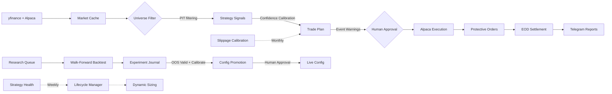

<div align="center">

# ⚡ Atlas

**Algorithmic swing-trading lab that researches, backtests, and live-trades systematic strategies on US equities.**

[](https://python.org)
[](#-broker)
[](#-strategies)
[](#-testing)
[](#-automation)

---

**S&P 500** via Alpaca &nbsp;•&nbsp; $0 commission &nbsp;•&nbsp; Long + Short &nbsp;•&nbsp; Fully automated daily operations

</div>

---

## 🏗️ Architecture

```
┌─────────────────────────────────────────────────────────────────────────┐
│                          ATLAS TRADING SYSTEM                          │
├─────────────────────────────────────────────────────────────────────────┤
│                                                                         │
│   ┌──────────┐    ┌──────────┐    ┌──────────┐    ┌──────────┐         │
│   │  Ingest   │───▶│ Universe │───▶│ Strategy │───▶│  Planner │         │
│   │ yf+Alpaca │    │  PIT ✓   │    │ Long+Short│   │ +Events  │         │
│   └──────────┘    └──────────┘    └──────────┘    └────┬─────┘         │
│                                                         │               │
│                                                         ▼               │
│   ┌──────────┐    ┌──────────┐    ┌──────────┐    ┌──────────┐         │
│   │Dashboard │◀───│ Journal  │◀───│ Executor │◀───│ Approval │         │
│   │ (5 tabs) │    │ & Ledger │    │ (Alpaca) │    │  Gate 🔒 │         │
│   └──────────┘    └──────────┘    └──────────┘    └──────────┘         │
│                                                                         │
│   ┌──────────────────────────────────────────────────────────────────┐  │
│   │  🔬 RESEARCH PIPELINE                                           │  │
│   │  Hypothesis → Backtest → Analyse → Calibrate → Promote → Live   │  │
│   │  (queue.json)  (8-core)  (journal)  (Brier)    (candidate)      │  │
│   └──────────────────────────────────────────────────────────────────┘  │
│                                                                         │
│   ┌──────────────────────────────────────────────────────────────────┐  │
│   │  🛡️ ADAPTIVE RISK LAYER                                         │  │
│   │  Dynamic Sizing → Lifecycle → Correlation → Event Calendar       │  │
│   │  (DD tiers)       (5-state)   (MV optim)    (FOMC/CPI/NFP)      │  │
│   └──────────────────────────────────────────────────────────────────┘  │
│                                                                         │
│   ┌──────────────────────────────────────────────────────────────────┐  │
│   │  🧠 PI AGENT LAYER (3-tier)                                      │  │
│   │  Extensions → Skills → Commands                                  │  │
│   │  (reactive)   (knowledge)  (dispatch)                            │  │
│   └──────────────────────────────────────────────────────────────────┘  │
│                                                                         │
└─────────────────────────────────────────────────────────────────────────┘
```

### Data Flow



---

## 💹 Markets

| Market | Tickers | Broker | Commission | Data Sources | Status |
|--------|---------|--------|------------|--------------|--------|
| 🇺🇸 **S&P 500** | 200 | Alpaca | $0 | yfinance + Alpaca API | ✅ Live (v3.0) |
| 🇦🇺 **ASX 200** | — | — | — | — | 📋 Monitor-only |

---

## 📈 Strategies

### Active (SP500 v3.0 — 7 enabled)

| Strategy | Style | Direction | Description |
|----------|-------|-----------|-------------|
| **Trend Following** | Trend | Long | Breakouts above dual MA crossover with volume confirmation, SMA-200 filter |
| **Mean Reversion** | Counter-trend | Long + Short | RSI(14) oversold/overbought + z-score entry, ATR profit target. Short signals on RSI>70, z>+2.0 |
| **Opening Gap** | Gap fade | Long | Fade significant overnight gaps with IBS confirmation |
| **Momentum Breakout** | Breakout | Long | 52-week high breakouts with relative strength ranking |
| **Sector Rotation** | Rotation | Long | Rotate into strongest sectors based on relative strength |
| **Short-Term MR** | Fast MR | Long | Aggressive mean reversion with tighter stops, highest signal volume |
| **Connors RSI(2)** | Counter-trend | Long | Ultra-short RSI(2) < 10 entries, SMA(5) exit |

### Short Selling

Mean Reversion generates short signals when `short_enabled: true`:
- **Entry**: RSI(14) > 70 + z-score > +2.0 (overbought)
- **Exit**: Direction-aware take-profit/stop-loss (inverted from long)
- **Engine**: Full direction-aware P&L, trailing stops track lowest price for shorts
- **Executor**: SELL to open, BUY to cover, inverted protective orders
- **Status**: Config-gated (`mean_reversion.short_enabled: false`), validation period required before live

### Disabled (under research)

| Strategy | Status |
|----------|--------|
| BB Squeeze | Near-breakeven after optimization (Sharpe -0.38) |
| MTF Momentum | Series comparison bugs, needs code audit |
| Dividend Capture | Needs further optimization |

---

## 🔬 Research System

Atlas runs a continuous research pipeline that autonomously discovers, tests, and promotes strategy improvements.

```
 🎩 Researcher        🧪 Backtester         📊 Analyst          🛡️ Risk
 ─────────────        ─────────────         ──────────          ─────────
 Read journal    ───▶  Execute queue   ───▶  Evaluate     ───▶  OOS validate
 Scan for gaps         (8-core ∥)           Calibrate           Stage candidate
 Queue hypotheses      Walk-forward          Journal             Telegram → Approve
```

**Core features:**
- **Walk-forward backtesting** — 756-day train / 126-day test / 63-day step windows, no look-ahead bias
- **Parallel execution** — 8-core parallelism, experiments batched for maximum throughput
- **Quick screen** — kill dead-end strategies in <10 seconds before committing to full backtests
- **OOS validation** — 3-test suite (time-period split, perturbation robustness, walk-forward consistency)
- **Promotion gates** — OOS validation → regression check → rate limit → human approval via Telegram
- **30+ strategies tested** — results tracked in TSV files per strategy with keep/discard history
- **Brain knowledge base** — closed decisions, confirmed patterns, and lessons prevent re-testing known dead ends

### Confidence Calibration

Signals include a confidence score calibrated against historical accuracy:

```
atlas calibrate                     # Run calibration analysis
```

- **Brier score** tracking per strategy (current: 0.350)
- **Bucket analysis** — every confidence tier shows positive expected value
- Calibration data feeds into dynamic sizing and plan generation

### Slippage Feedback Loop

Monthly automated recalibration of slippage estimates using actual fill data:

- `scripts/slippage_calibration.py` compares expected vs actual fill prices
- Gated on ≥20 fills for statistical significance
- Updates `fees.slippage_pct` in config when drift exceeds threshold
- Runs via `pi-cron.sh slippage-cal`

### Rejected Signal Analysis

Quantifies the opportunity cost of filtering:

- Loads historical plan files, extracts rejected entries
- Per-strategy rejection rates and reason distribution
- Hypothetical P&L — what would have happened if rejected signals were accepted
- Weekly Telegram report with top missed trades

---

## 🛡️ Risk Management

### Static Limits

```
Per-Trade:     0.35% max risk
Positions:     Max 10 open
Sector:        Max 2 positions per sector
Daily DD:      2% max → auto-halt trading
Stop-Loss:     Required on every position (broker-side GTC orders)
Take-Profit:   Broker-side limit sell orders
Confidence:    Min 0.75 signal threshold
```

### Dynamic Position Sizing

Automatically scales position sizes based on portfolio drawdown:

| Drawdown | Scale Factor | Effect |
|----------|-------------|--------|
| < 4% | 1.00× | Full size |
| 4–7% | 0.75× | Reduced exposure |
| 7–10% | 0.50× | Half size |
| > 10% | 0.25× | Minimal positions |

Conservative tiers calibrated for $3,500 account — 2% drawdown ($70) would trigger on normal noise.

### Strategy Lifecycle Automation

Five-state lifecycle machine monitors each strategy's health:

```
RAMP_UP → ACTIVE → WATCH → PROBATION → SUSPENDED
```

- **RAMP_UP**: New strategy, limited allocation, monitoring period
- **ACTIVE**: Normal operation, full allocation
- **WATCH**: Performance degrading, increased monitoring
- **PROBATION**: Persistent degradation, allocation reduced
- **SUSPENDED**: Auto-halted, zero allocation, manual review required

State persists in `logs/lifecycle_state.json`. Transitions trigger Telegram alerts.

### Portfolio Intelligence

- **Mean-Variance Optimization** — scipy SLSQP minimizes portfolio variance with Sharpe tilt (`portfolio_optimizer.method: "mean_variance"`)
- **Correlation Clustering** — Union-find groups correlated strategies (r > 0.7). MR/CR2/OG correctly identified as mean-reversion family
- **Sharpe-weighted inverse-vol fallback** — Used when MV fails (singular covariance, insufficient data)

### Event Calendar

Tracks market-moving events with configurable impact on trading:

| Event | Frequency | Impact | Source |
|-------|-----------|--------|--------|
| FOMC | 8/year | High | JSON schedule |
| CPI | Monthly | High | JSON schedule |
| NFP | Monthly | High | Computed (1st Friday) |
| OPEX | Monthly | Medium | Computed (3rd Friday) |
| Rebalance | Quarterly | Medium | Computed (3rd Friday, Mar/Jun/Sep/Dec) |

- `get_event_proximity()` — days until next FOMC, CPI, NFP, OPEX, REBAL
- Plan annotations warn about nearby events (info-only, `block_entries: false`)
- Backtest signals enriched with event proximity features for research

---

## 📊 Backtest Engine

Walk-forward simulation with extracted pipeline architecture:

### Pipeline Architecture

```
┌─────────────┐    ┌─────────────┐    ┌─────────────┐
│ Entry Gates  │───▶│ Enrichment  │───▶│ Signal Gen  │
│ (filters.py) │    │(enrichment) │    │ (strategies)│
└─────────────┘    └─────────────┘    └─────────────┘

DayContext → run_entry_gates() → enrich_signals() → inject_event_features()
```

- **Entry Gates** (`backtest/filters.py`): VIX gate, FRED yield curve/claims, turn-of-month, macro regime — pure functions
- **Enrichment** (`backtest/enrichment.py`): Breadth, relative strength, macro confidence, event features
- **Pipeline** (`backtest/pipeline.py`): DayContext dataclass orchestrates gate + enrichment flow
- **Engine** (`backtest/engine.py`): Walk-forward loop, position management, direction-aware P&L

### Direction-Aware Simulation

Full long + short support:
- P&L: `(entry - exit) × shares` for shorts, `(exit - entry) × shares` for longs
- Trailing stops: track lowest price for shorts (trigger on rise above stop)
- MAE/MFE: inverted for shorts (adverse = price rise, favorable = price drop)
- Max-loss exits: direction-aware unrealized P&L

### Point-in-Time Universe

Eliminates survivorship bias by reconstructing historical S&P 500 membership:

- `data/sp500_changes.csv` — 152 membership changes (2019–2025)
- `data/sp500_history.py` — backward-walk reconstruction algorithm
- Config: `universe.point_in_time: true` (default: `false` for backward compatibility)

---

## 🔍 Monitoring & Recovery

### Strategy Health Monitoring

Weekly automated health checks:
- `scripts/strategy_health_cron.py` — generates per-strategy health reports
- Feeds lifecycle state machine transitions
- Telegram alerts on state changes

### Disaster Recovery

Broker-local reconciliation with auto-fix:

```bash
atlas reconcile                     # Check for position mismatches
atlas reconcile --fix               # Auto-fix discrepancies
```

- Detects: missing local positions, missing broker positions, SL-filled positions
- Auto-fix: re-syncs state, closes orphaned positions
- Reports via Telegram with severity ratings
- Cron mode: `pi-cron.sh reconcile`

### Config Validation

Schema-based validation catches typos and type errors:

```bash
python3 -c "from config.schema import validate_config_file; print(validate_config_file('config/active/sp500.json'))"
```

- Validates types, ranges, enums for all config sections
- Checks strategy `enabled` fields, allocation pool consistency
- Collects ALL errors (not fail-fast) for user-friendly diagnostics

### Intraday Entry Timing

Sub-daily price data for refined entry execution (config-gated):

- 15-minute bars via Alpaca API with parquet cache
- MR dip limits, momentum breakout confirmation
- DAY limit orders with `cancel_unfilled_limits()` cleanup

---

## 📱 Dashboard

Five-tab HTML dashboard generated from JSON data:

| Tab | Content |
|-----|---------|
| **Trading** | Portfolio overview, positions, equity curve, P&L |
| **Research** | Experiment results, strategy comparison, journal |
| **Health** | Strategy lifecycle states, backtest reference metrics |
| **Events** | FOMC/CPI/NFP proximity KPIs, upcoming events calendar |
| **System** | Reconciliation status, config validation, cron health |

Keyboard shortcuts: `T` Trading, `R` Research, `H` Health, `E` Events, `S` System

---

## 🤖 Automation

### Pi Agent Layer

Atlas is managed by [Pi](https://github.com/mariozechner/pi-coding-agent) agents with a 3-tier architecture:

**Extensions** (reactive — fire automatically on lifecycle events):

| Extension | Trigger | Function |
|-----------|---------|----------|
| `atlas-context-injector` | Session start, every prompt | Injects system state + intent-specific context |
| `atlas-safety-gates` | Every tool call | Blocks dangerous writes to config/active/, services |
| `atlas-commands` | User input | 9 slash commands for common operations |
| `atlas-status-dashboard` | Session start, every turn | Footer status bar with health, equity, config version |
| `atlas-jobs` | Tool calls | Async job execution with tracking |
| `atlas-risk-gates` | Tool calls | Promotion and plan approval gates |
| `atlas-state` | Tool calls | Portfolio state, equity curves, config reading |
| `atlas-artifacts` | Tool calls | Backtest result summarization and comparison |

**Skills** (knowledge — loaded on demand per task):

| Skill | Purpose |
|-------|---------|
| `atlas-daily` | Daily pre-market and post-close workflows |
| `atlas-research-loop` | Autonomous research session procedure |
| `atlas-healthz` | Full system health audit |
| `atlas-strategy-discovery` | Strategy implementation and validation |
| `atlas-reoptimize` | Re-optimization and config promotion |
| `atlas-director` | Research queue management |
| `atlas-codebase` | Directory map, CLI reference, config structure |
| `atlas-lessons` | 35+ operational lessons organized by domain |
| `atlas-incident` | 20 known failure patterns with root causes and fixes |
| `atlas-backtest` | Backtest procedures, result interpretation, OOS validation |
| `atlas-brain` | Research knowledge navigation, decisions, patterns |
| `atlas-state-queries` | "I want to check X → do Y" quick reference |

### Cron Schedule (AEST)

| Time | Day | Job | Description |
|------|-----|-----|-------------|
| 18:00 | Mon–Fri | `healthz_autofix.sh` | Health check → auto-fix if issues found |
| 19:00 | Mon–Fri | `pi-cron.sh premarket` | Data refresh → plan → Telegram summary |
| 19:15 | Mon–Fri | `sync_protective_orders.py` | Sync SL/TP orders to Alpaca |
| 23:45 | Mon–Fri | `sync_protective_orders.py` | Re-sync protective orders |
| 01:30–07:30 | Tue–Sat | `intraday_monitor.py` | Hourly intraday position checks |
| 08:00 | Tue–Sat | `pi-cron.sh postclose` | EOD settlement → dashboard → report |
| 1st Sun/month | Monthly | `pi-cron.sh slippage-cal` | Slippage calibration from fill data |
| 06:00 | Sunday | `weekly_maintenance.sh` | Log rotation, cache cleanup |

**Telegram integration** — alerts on plan summaries (📊), equity snapshots (📈), lifecycle changes (🔄), errors (🚨), and promotion requests with inline Approve/Reject buttons.

---

## ⚙️ CLI

```bash
# ── Portfolio ──────────────────────────────────────────
atlas status                        # positions, P&L, equity
atlas status -m sp500               # target specific market

# ── Daily Workflow ─────────────────────────────────────
atlas ingest                        # refresh OHLCV data from yfinance + Alpaca
atlas universe                      # rebuild filtered universe
atlas plan                          # generate today's trade plan
atlas approve                       # approve pending plan
atlas live-run                      # execute via Alpaca

# ── Analysis ───────────────────────────────────────────
atlas backtest                      # walk-forward backtest
atlas calibrate                     # confidence score calibration
atlas ledger                        # trade history
atlas review                        # performance vs expectations
atlas history                       # live execution history with fees
atlas fees                          # analyse actual fees vs config

# ── Broker ─────────────────────────────────────────────
atlas broker                        # Alpaca connection & account status
atlas orders                        # open orders
atlas sync                          # reconcile with broker
atlas reconcile                     # full state reconciliation with auto-fix
atlas halt                          # emergency: cancel all open orders

# ── System ─────────────────────────────────────────────
atlas markets                       # list available markets
atlas market-check                  # check market state & trading calendar
atlas schedule                      # show cron schedule
atlas setup-secrets                 # configure credentials
```

> All commands accept `--market` / `-m` to target a specific market.

---

## 🧪 Testing

**888 tests** covering all modules:

| Module | Tests | Coverage |
|--------|-------|----------|
| Strategies & signals | 86 | Signal generation, validation, direction |
| Short selling | 43 + 23 + 40 | Signals, engine P&L, executor orders |
| Backtest pipeline | 30 + 12 | Filters, enrichment, DayContext delegation |
| Portfolio optimizer | 17 | MV weights, correlation clustering |
| Event calendar | 47 + 14 | FOMC/CPI/NFP schedules, proximity, enrichment |
| Strategy lifecycle | 45 | 5-state machine, transitions, alerts |
| Config schema | 99 | Validation, types, ranges, enums |
| Rejected signals | 46 | Analysis pipeline, hypothetical P&L |
| Reconciliation | 42 | State reconciler, auto-fix, Telegram |
| Entry optimizer | 31 | Intraday refinement, limit orders |
| SP500 history | 28 | PIT universe reconstruction |
| Other | 285 | Ingest, plan, universe, health, ledger |

```bash
pytest tests/ -q                    # run all tests (~5 seconds)
```

---

## 📁 Project Structure

```
atlas/
├── backtest/
│   ├── engine.py           Walk-forward engine (direction-aware, long+short)
│   ├── filters.py          Pure gate functions (VIX, FRED, TOM, macro)
│   ├── enrichment.py       Signal enrichment (breadth, RS, macro, events)
│   └── pipeline.py         DayContext + orchestrators (run_entry_gates, enrich_signals)
├── brokers/
│   ├── alpaca/             Alpaca adapter, market data, protective orders
│   ├── plan.py             Trade plan generation with event warnings
│   └── live_executor.py    Order execution (long+short, direction-aware)
├── config/
│   ├── active/             Live configs (sp500.json)
│   ├── candidates/         Staged configs awaiting promotion
│   ├── schema.py           Config validation (JSON Schema-style)
│   └── versions/           Pre-promotion config snapshots
├── dashboard/
│   ├── generate_data.py    Data generation (trading, research, health, events, system)
│   └── templates/          5-tab HTML dashboard
├── data/
│   ├── ingest.py           Dual-source data ingestion (yfinance + Alpaca)
│   ├── events.py           Event calendar (FOMC, CPI, NFP, OPEX, REBAL)
│   ├── intraday.py         15-min bar data via Alpaca
│   ├── sp500_history.py    Point-in-time S&P 500 membership reconstruction
│   └── sp500_changes.csv   152 membership changes (2019–2025)
├── monitor/
│   ├── strategy_health.py  Live performance tracking
│   └── lifecycle.py        5-state lifecycle manager (RAMP_UP→SUSPENDED)
├── pi-package/             Pi agent extensions (8) + skills (12)
├── research/
│   ├── brain/              Knowledge base (decisions, experiments, patterns)
│   ├── calibration.py      Confidence score calibration (Brier score)
│   ├── rejected_signal_analysis.py  Opportunity cost of filtering
│   ├── best/               Best-known params per strategy
│   └── results/            Per-strategy experiment history (TSV)
├── scripts/
│   ├── cli.py              CLI entry point (atlas command)
│   ├── reconcile.py        Broker-local state reconciliation
│   ├── slippage_calibration.py  Monthly slippage recalibration
│   ├── strategy_health_cron.py  Weekly health reports
│   └── pi-cron.sh          Cron dispatcher
├── strategies/             Strategy implementations (BaseStrategy ABC)
├── tests/                  888 tests
├── universe/               Ticker universe builder (PIT-aware)
└── utils/
    ├── allocation.py       Pool caps with lifecycle overrides
    ├── dynamic_sizing.py   Drawdown-based position scaling
    ├── config.py           Config loading
    ├── indicators.py       Technical indicators
    └── telegram.py         Telegram notifications
```

---

## 🔧 Setup

### Requirements

- Python 3.10+
- **Core:** `pandas`, `numpy`, `yfinance`, `scipy`
- **Live trading:** `alpaca-py`
- **Automation:** [Pi](https://github.com/mariozechner/pi-coding-agent)

### Credentials

```bash
python3 scripts/cli.py setup-secrets
```

Stored in `~/.atlas-secrets.json` (600 permissions, never committed):

```json
{
  "ALPACA_API_KEY": "...",
  "ALPACA_SECRET_KEY": "...",
  "telegram_bot_token": "...",
  "telegram_chat_id": "..."
}
```

### Alpaca DNS Fix

If API calls timeout, add to `/etc/hosts`:
```
34.232.237.2 api.alpaca.markets
```

---

## 🧠 Key Design Decisions

| Decision | Choice | Rationale |
|----------|--------|-----------|
| Broker as source of truth | Alpaca API, no paper trading layer | Eliminates state sync bugs |
| Commission-free | Alpaca ($0) | Eliminates fee drag in small accounts |
| Dual data source | yfinance primary + Alpaca fallback | Redundancy for data outages |
| SMA-200 filter | All SP500 strategies | +47% Sharpe, -1.2pp drawdown in A/B test |
| Combined-only promotion | Portfolio backtest required | Solo metrics unreliable at low equity |
| VIX filter | Rejected | Destroys mean-reversion alpha |
| Config blending | Rejected | Pick best config, don't average — zero robustness gain |
| Conservative dynamic sizing | 4%/7%/10% DD tiers | 2% DD = $70 on $3,500 triggers on noise, crushing CAGR by 23.78pp |
| PIT universe default off | `point_in_time: false` | Backward compat; enable for bias-free backtests |
| Event calendar info-only | `block_entries: false` | Annotations only until data analysis complete |
| Short selling config-gated | `short_enabled: false` | 3+ month backtest validation required before live |
| MV optimizer as option | `portfolio_optimizer.method` dispatch | Fallback to SR/σ when covariance is singular |
| Intraday entry disabled | `intraday.enabled: false` | Data collection phase before live use |

---

<div align="center">

*Built for live trading. Broker is sole source of truth. 888 tests. Zero tolerance for state drift.*

</div>
